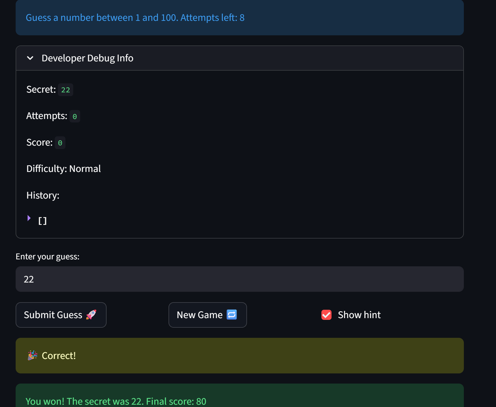

# 🎮 Game Glitch Investigator: The Impossible Guesser

## 🚨 The Situation

You asked an AI to build a simple "Number Guessing Game" using Streamlit.
It wrote the code, ran away, and now the game is unplayable. 

- You can't win.
- The hints lie to you.
- The secret number seems to have commitment issues.

## 🛠️ Setup

1. Install dependencies: `pip install -r requirements.txt`
2. Run the broken app: `python -m streamlit run app.py`

## 🕵️‍♂️ Your Mission

1. **Play the game.** Open the "Developer Debug Info" tab in the app to see the secret number. Try to win.
2. **Find the State Bug.** Why does the secret number change every time you click "Submit"? Ask ChatGPT: *"How do I keep a variable from resetting in Streamlit when I click a button?"*
3. **Fix the Logic.** The hints ("Higher/Lower") are wrong. Fix them.
4. **Refactor & Test.** - Move the logic into `logic_utils.py`.
   - Run `pytest` in your terminal.
   - Keep fixing until all tests pass!

## 📝 Document Your Experience

- [ ] Describe the game's purpose.
- The purpose of the game was to debug a number guessing tool that was generated using AI. Given the AI nature of the code, it was full of small bugs despite overall being functional. By working with the code on the back and the front end, I was able to spot several bugs and fix a few, finally developing test cases to make sure the logic was working as intended.
- [ ] Detail which bugs you found.
- The hints were flipped — check_guess returned "Too High" when the guess was below the secret and vice versa. The difficulty ranges were switched, with Normal being wider than Hard. Attempts was initialized to 1 instead of 0, causing an off-by-one on first load that was inconsistent with the new game reset.
- [ ] Explain what fixes you applied.
- Swapped the outcome labels in check_guess so "Too Low" and "Too High" correctly reflect the guess direction. Fixed get_range_for_difficulty so Easy is 1–20, Normal 1–50, and Hard 1–100. Changed the initial attempts session state value from 1 to 0 to match the new game reset.

## 📸 Demo

- [ ] []

## 🚀 Stretch Features

- [ ] [If you choose to complete Challenge 4, insert a screenshot of your Enhanced Game UI here]
